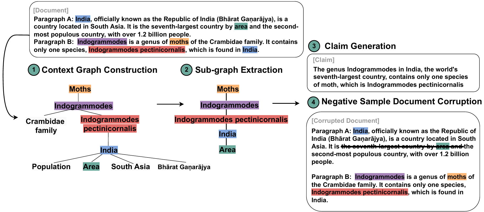
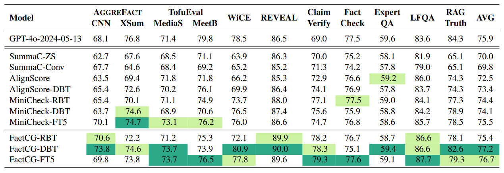
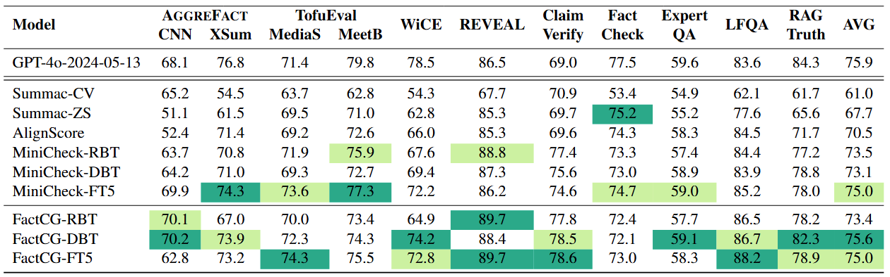

# FactCG: Enhancing Fact Checkers with Graph-Based Multi-Hop Data

Pytorch implementation of our EMNLP 2025 paper: [FactCG: Enhancing Fact Checkers with Graph-Based Multi-Hop Data](https://arxiv.org/pdf/2501.17144).

We propose a fact-checker to detect Large language Model ungrounded hallucinations and a synthetic data generation method to collect high quality training data.

We leverage LLM to convert text documents into content graphs. Graph data, in semi-structured form, is easier to manipulate in both neural and symbolic ways than text. Thus allow us to create high quality and high granularity syhthetic data with high control.

<p align="center"></p>

Prior research on training grounded factuality classification models to detect hallucinations in large language models (LLMs) has relied on public natural language inference (NLI) data and synthetic data. However, conventional NLI datasets are not well-suited for document-level reasoning, which is critical for detecting LLM hallucinations. Recent approaches to document-level synthetic data generation involve iteratively removing sentences from documents and annotating factuality using LLM-based prompts. While effective, this method is computationally expensive for long documents and limited by the LLM's capabilities. In this work, we analyze the differences between existing synthetic training data used in state-of-the-art models and real LLM output claims. Based on our findings, we propose a novel approach for synthetic data generation, CG2C, that leverages multi-hop reasoning on context graphs extracted from documents. Our fact checker model, \ours, demonstrates improved performance with more connected reasoning, using the same backbone models. Experiments show it even outperforms GPT-4-o on the LLM-A{\small GGRE}F{\small ACT} benchmark with much smaller model size.

If you find the repository or FactCG helpful, please cite the following paper
```bibtex
@inproceedings{lei2025factcg,
  title={FactCG: Enhancing Fact Checkers with Graph-Based Multi-Hop Data},
  author={Lei, Deren and Li, Yaxi and Li, Siyao and Hu, Mengya and Xu, Rui and Archer, Ken and Wang, Mingyu and Ching, Emily and Deng, Alex},
  journal={NAACL},
  year={2025}
}
```

## LLM-Aggrefact Leaderboard
We evaluate FactCG with dynamic threshold and fixed threshold settings on LLM-Aggrefact (<1B models). Highest score (except GPT) for each dataset is highlighted with dark green and second highest score highlighted with light green. We observe that FactCG-DBT with only 0.4B parameter achieves best BAcc.
### Dynamic Threshold (our preferred way)
We adjust the threshold for each LLM-AGGREFACT dataset to two decimal places, optimizing for the best performance on the validation set. In this way, we can assess fact-checkers' optimal performance without fine-tuning for each specific scenario.
<p align="center"></p>

### Fixed Threshold
We fix the thresohld to 0.5.
<p align="center"></p>

## Checkpoint
We provide FactCG with deberta-v3-large backbone (0.4B parameters) pytorch lightning checkpoint at

https://huggingface.co/yaxili96/FactCG-DeBERTa-v3-Large/tree/main/pytorch_lightning_ckpt

We also upload the checkpoint to huggingface as a safetensor with model name as `yaxili96/FactCG-DeBERTa-v3-Large`

To run `benchmark.sh` using huggingface model checkpoint, specify the `use_hf_ckpt` parameter. Otherwise download the lightning checkpoint, create `ckpt` folder in the root directory and place the checkpoint inside, and specify the `factcg_ckpt`

```shell
CUDA_VISIBLE_DEVICES=1 python3 benchmark.py --threshold-setting fixed --factcg --factcg-model-name microsoft/deberta-v3-large --use-hf-ckpt
```

```shell
FACTCG_CKPT="ckpt/factcg_dbt.ckpt"
CUDA_VISIBLE_DEVICES=1 python3 benchmark.py --threshold-setting fixed --factcg --factcg-model-name microsoft/deberta-v3-large --factcg-ckpt $FACTCG_CKPT
```

you can also load our model directly via huggingface:
```python
from transformers import AutoTokenizer, AutoConfig, AutoModelForSequenceClassification
config = AutoConfig.from_pretrained("yaxili96/FactCG-DeBERTa-v3-Large", num_labels=2, finetuning_task="text-classification", revision='main', token=None, cache_dir="./cache")
config.problem_type = "single_label_classification"
tokenizer = AutoTokenizer.from_pretrained("yaxili96/FactCG-DeBERTa-v3-Large", use_fast=True, revision='main', token=None, cache_dir="./cache")
model = AutoModelForSequenceClassification.from_pretrained(
            "yaxili96/FactCG-DeBERTa-v3-Large", config=config, revision='main', token=None, ignore_mismatched_sizes=False, cache_dir="./cache")
```

Note: The pytorch_lightning checkpoint has everything needed to restore a pytorch lightning training session. You can extract the model parameters for a light-weight inference usage.

## Installation

We trained and evaluated our model using `torch==2.2.1` and `pytorch_lightning>=2.2.0`. We recommend using the same version for reproducibility. 

### Pip install factcg

You can install `factcg` by cloning this repository and `pip install .`.

```python
from factcg import FactCGScore

scorer = FactCGScore(model_name="microsoft/deberta-v3-large",
                     batch_size=16, ckpt_path="./ckpt/factcg_dbt.ckpt", verbose=False)
score = scorer.score(contexts=['sun raises from east'], claims=['sun raises from west'])
print(score) # example output [0.06528743356466293]
score = scorer.score(contexts=['sun raises from west'], claims=['sun raises from west'])
print(score) # example output [0.7840349674224854]
```
`model_name`: the backbone model. 'microsoft/deberta-v3-large' for instance.

`batch_size`: batch size for inference.

`ckpt_path`: the path to the checkpoint. [download-here]

`verbose`: whether to output the progress bar

### Install for benchmarking
Please note due to legacy issue, some of previous work on fact-checkers have dependency conflict. For example, AlignScore requires `pytorch-lightning<2 and >=1.7.7` but we used a higher version. Therefore there are some extra dependencies to run the benchmarking besides our factcg. Due to time constrain we didn't explore resolving those conflicts into a unified python env. Please check the following env requirements for previous work on fact-checkers:

requirements for `minicheck`:
```pip
minicheck @ git+https://github.com/Liyan06/MiniCheck.git@main
accelerate>=0.26.0
```

requirements for `alignscore` and `summa`, `summac`
```pip
alignscore @ git+https://github.com/yuh-zha/AlignScore.git@main # pytorch-lightning<2 and >=1.7.7
summa==1.2.0
summac==0.0.3  #summac 0.0.3 depends on transformers==4.8.1
```
## Training
To reproduce FactCG-DBT with 2-stage  training
```
sh train.sh
```

## Evaluation
1.  Evaluate on LLM-Aggrefact Benchmark
```
./benchmark.sh
```
Note:
* you can evaulate different fact-checkers: `FactCG`, `Minicheck`, `AlignScore`, `SummaC-ZS` and `SummaC-CV`
* you can choose `threshold-setting` as `tune` for selecting the best threshold per best dev set performance in LLM-Aggrefact, or as `fixed` for fixing threshold to 0.5.

2.  Evaluation on Connected Reasoning

```
python3 wice_connected_reasoning.py --method factcg
```
